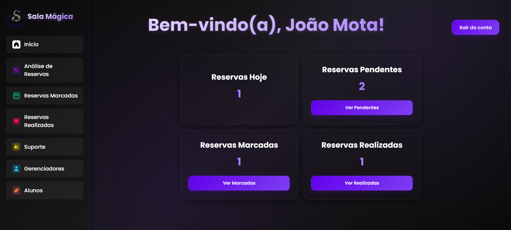

# ⚛️ Sala Mágica - Web App

> Interface web para sistema de reserva de salas e equipamentos escolares desenvolvida em React


## 🚀 Sobre o Projeto

O **Sala Mágica Web** é uma aplicação web moderna que complementa o sistema mobile, oferecendo uma interface administrativa completa para gerenciamento de reservas, usuários e recursos. Desenvolvida com React e design responsivo.

## ✨ Funcionalidades

### 🔐 **Autenticação**
- Login administrativo
- Recuperação de senha
- Controle de sessão

### 📊 **Dashboard Administrativo**
- Visão geral do sistema
- Estatísticas de uso
- Gráficos e relatórios
- Análise de reservas

### 👥 **Gerenciamento de Usuários**
- Listagem de usuários
- Aprovação de cadastros
- Controle de permissões
- Histórico de atividades

### 📋 **Gerenciamento de Reservas**
- Visualização de todas as reservas
- Aprovação/rejeição de solicitações
- Calendário de reservas
- Relatórios detalhados

### 🏢 **Gerenciamento de Recursos**
- Cadastro de salas e equipamentos
- Controle de disponibilidade
- Manutenção de recursos
- Histórico de uso

## 🛠️ Tecnologias Utilizadas

- **React 18** - Biblioteca principal
- **JavaScript ES6+** - Linguagem de programação
- **CSS3** - Estilização
- **Axios** - Requisições HTTP
- **React Router** - Roteamento
- **Chart.js** - Gráficos e relatórios
- **Vite** - Build tool

## 📦 Dependências Principais

```json
{
  "dependencies": {
    "react": "^18.2.0",
    "react-dom": "^18.2.0",
    "react-router-dom": "^6.8.0",
    "axios": "^1.3.0",
    "chart.js": "^4.2.0",
    "react-chartjs-2": "^5.2.0"
  }
}
```

## 🚀 Como Executar

### Pré-requisitos
- Node.js 16+
- npm ou yarn
- Backend Spring Boot rodando

### Instalação

1. **Clone o repositório**
```bash
git clone https://github.com/seu-usuario/SalaMagicaReact.git
cd SalaMagicaReact
```

2. **Instale as dependências**
```bash
npm install
# ou
yarn install
```

3. **Configure a API**
   - Verifique a URL da API em `src/services/api.js`
   - Certifique-se que o backend está rodando em `http://localhost:8080`

4. **Execute a aplicação**
```bash
npm run dev
# ou
yarn dev
```

A aplicação estará disponível em: `http://localhost:5173`

## 🏗️ Estrutura do Projeto

```
src/
├── components/           # Componentes reutilizáveis
│   ├── Header/
│   ├── Sidebar/
│   ├── Charts/
│   └── Tables/
├── pages/               # Páginas da aplicação
│   ├── Login/
│   ├── Dashboard/
│   ├── Users/
│   ├── Reservations/
│   └── Resources/
├── services/            # Serviços de API
│   └── api.js
├── styles/              # Estilos globais
│   └── global.css
├── utils/               # Utilitários
│   └── helpers.js
├── App.jsx             # Componente principal
└── main.jsx           # Ponto de entrada
```

## 🎨 Design System

### Cores
```css
:root {
  --primary: #6200ea;
  --secondary: #7e3ff2;
  --background: #0a0a0a;
  --surface: #1a1a1a;
  --text: #ffffff;
  --text-secondary: rgba(255, 255, 255, 0.7);
}
```

### Componentes
- **Cards** - Containers com elevação
- **Buttons** - Botões com gradiente
- **Tables** - Tabelas responsivas
- **Charts** - Gráficos interativos

## 📊 Funcionalidades Administrativas

### Dashboard

- Total de usuários ativos
- Reservas do dia/semana/mês
- Recursos mais utilizados
- Gráficos de tendências

## 📱 Responsividade

- **Desktop** - Interface completa
- **Tablet** - Layout adaptado
- **Mobile** - Versão simplificada

## 🚀 Build para Produção

```bash
npm run build
# ou
yarn build
```

## 👥 Equipe

- **João Pedro Mota Silva** - Desenvolvedor Principal
- **Gabriel Barbosa** - Colaborador

## 📞 Contato

- Email: joaomotasilva10@outlook.com
- GitHub: [JoaoMotaSilva10](https://github.com/JoaoMotaSilva10)

---

⭐ **Se este projeto te ajudou, deixe uma estrela!**